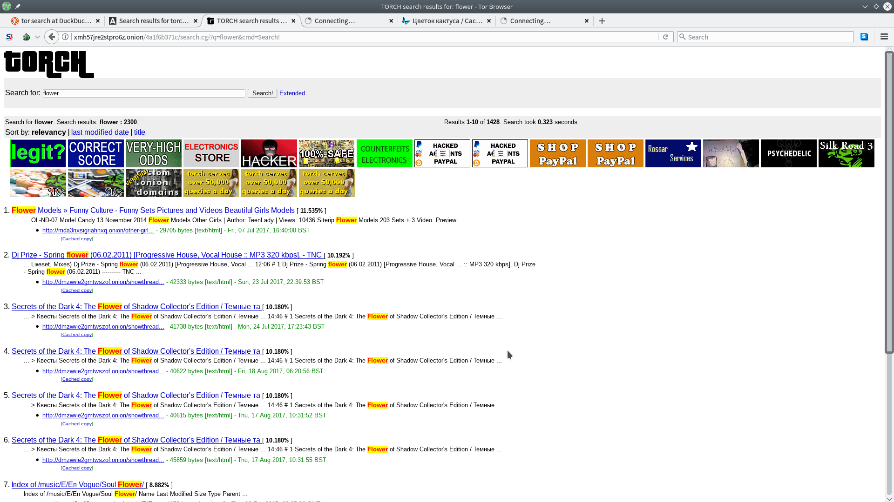
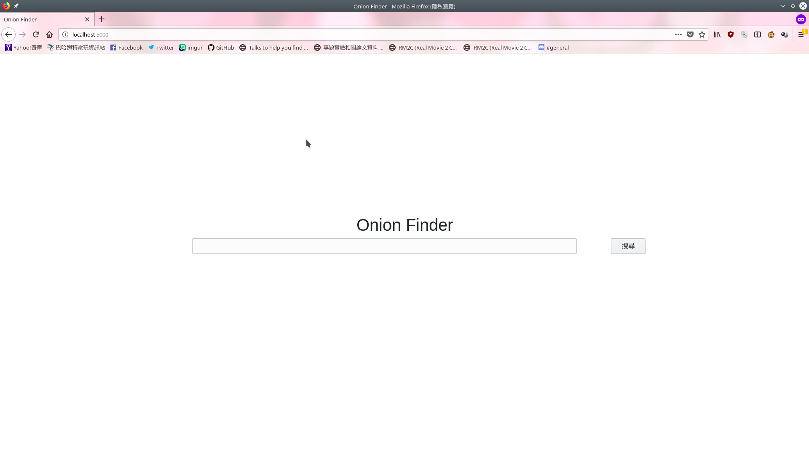
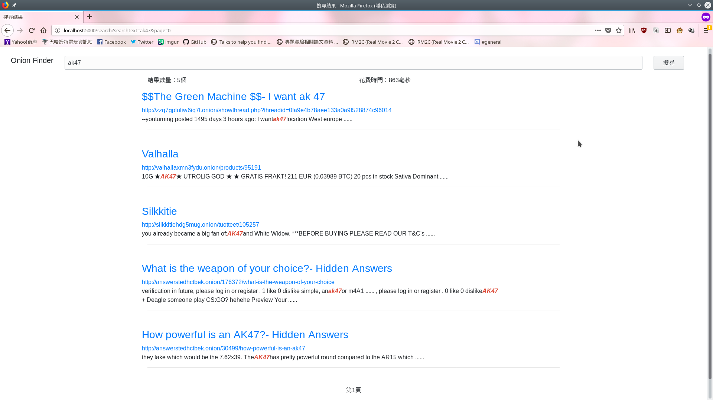

# Onion Finder
### Author: John Chien

## 緣起
在Tor network裡面，[torch][1]算是很大型的搜尋網站，然而他並沒有持續更新網站的存活與否，會變成說，搜尋到的幾千筆頁面，其實只有幾十筆是可以正常連線的。

舉例以關鍵字「flower」作為測試的搜尋，但是其顯示出來的搜尋結果，第8名和第10名無法連上，代表該網站已經掛掉了，但是Torch搜尋引擎還是存著該網站的資料。搜尋的關鍵字越是敏感和非法，排名前面的網站就越容易掛掉，這一部份是Torch很致命的缺點。



## 獲取還活著的.onion網站
由網友Daniel所寫出來的php程式和網站[「Onion link list」][2](需要Tor的連線)，有一起把其他網站整理好的.onion網域的網站，一起整理進去，還順便分類，注記加入時間、最後可以連上的時間等等。其中的「最後可以連上的時間」這個標籤，就可以拿來做為辨別網站是否還活著的關鍵。

所以我先從[Onion link list][2]裡面下載json格式，然後讀取該檔案，並且一筆筆的確認「lastup」這個tag的內容。我的網站還活著的定義是「最後可以連上的時間是比昨天還要晚」，這樣至少可以確保網站只有掛掉不到24小時而已。又因為該json裡面存的lastup的單位是「Unix Time Stamp」所以需要額外的轉換，我就一起把處理時間相關的東西，合在一個python的function裡面處理掉了。

這部份請參閱我另外一個project[「onion crawler」][3]，我是把當初寫的一些程式碼拿來用。程式碼的一部分可以看下面的程式碼。

``` python
import datetime


def stillUpOrNot(lastUpTime):
    '''
    Parameter: lastUpTime should be a datetime.datetime object.
    It will reture True = the website is working, False = the website is down
    '''
    nowtime = datetime.datetime.now()
    oneday = datetime.timedelta(days=1)
    yesterday = nowtime - oneday
    return (yesterday < lastUpTime)
```

然後就是很簡單的開檔、讀檔、呼叫stillUpOrNot函式，最後把確定還活著的網站網址清單寫出去。

``` python
def writeURLPool(jsonFileName, urlPoolFileName):
    '''
    This function decode json file from Daniel and write valie onion url list
    The url list/pool's name is passed by argument and open file in function
    This function will also check lasttest field to avoid dead website.
    '''
    jsonfileptr = open(jsonFileName,'r')
    decode_list = json.load(jsonfileptr)

    urlPoolPtr = open(urlPoolFileName, 'w')

    allURL = []
    for oneRecord in decode_list[u'onions']:
        lastUpTime = datetime.datetime.fromtimestamp(int(oneRecord[u'lastup']))
        print('This website\' lastup: '+str(lastUpTime))
        siteStatus = stillUpOrNot(lastUpTime)
        print('Still up or not: '+str(siteStatus))
        allURL.append(oneRecord[u'address']+'.onion')

    for url in allURL:
        urlPoolPtr.write(url+'\n')
    

    jsonfileptr.close()
    urlPoolPtr.close()
```
最後則是從網站提供的7507個網站，選出了7406個還活著的網站。

## 爬蟲-ACHE Crawler
使用現成的ACHE Crawler，他提供包含爬蟲、Tor proxy等等一整套的docker container。

我在[「onion crawler」][3]是自己寫爬蟲，可是效率很差，而且只是單純的把網頁抓下來而已。
所以我搜尋了網路現成的爬蟲，發現了這個爬蟲工具，他直接提供了爬取Tor Network的工具，
甚至還直接附上docker的elasticsearch kernel和界面，所以我就使用此工具來爬了。

1. 修改tor.seeds  
tor.seeds是爬蟲要爬的清單。
```
http://22222222235tlt3z.onion
http://2222222223nsklub.onion
http://2222222223za3joq.onion
http://22222222245vziyv.onion
http://2222222225ucqblu.onion
http://222222222erawewi.onion
http://222222222fum5vem.onion
http://222222222fyhdxlj.onion
http://222222222m323qr3.onion
http://222222222olnyqbc.onion
http://222222222vbwd5ro.onion
http://222222222vte27lb.onion
http://2222222234uysu6r.onion
http://2222222237z3q52l.onion
http://222222224gidecov.onion
http://22222222b5jjiakx.onion
http://22222222bfneiznf.onion
http://22222222gnu35moa.onion
http://22222222gudgigfi.onion
http://22222222hkqnx4ec.onion
http://22222222jpg4oobq.onion
...
...
...
```
2. 確認ache.yml設定檔有沒有錯誤  
這裡設定了爬蟲要把資料存成檔案和直接餵給elasticsearch。  
也設定了如果爬蟲看到有不是seeds裡面的網站，要不要記錄下來，爬出去，這邊的設定是「要」。  
所以儘管只有7406個網站，所爬到的資料卻是10萬多筆。  
最後也設定的tor network的proxy要怎麼連線等等。  
``` yml
# Configure ELASTICSEARCH and FILES data formats
target_storage.data_formats:
  - ELASTICSEARCH
  - FILES

target_storage.data_format.elasticsearch.rest.hosts:
  - http://elasticsearch:9200

# Basic configuration in-depth web site crawling
link_storage.link_strategy.use_scope: true
link_storage.link_strategy.outlinks: true
link_storage.scheduler.host_min_access_interval: 1000

# Configure ACHE to download .onion URLs through the TOR proxy container
crawler_manager.downloader.torproxy: http://torproxy:8118
```

我本次的專案沒有修改到這個檔案。


3. 開始爬蟲  
下指令`sudo docker-compose up`就會開始啟動/下載相關的docker container。  
在爬蟲的時候，可以進入ACHE Crawler提供的Monitor頁面`http://localhost:8080/monitoring/default`
裡面會有現在在Queue的連結個數，總共發了多少個request等等相關資訊。


## 網頁界面與elasticsearch 
elasticsearch的query設定：
``` python
    searchDSL = {
        "from" : int(searchpage)*10, "size" : 10,
        "query": {
            #match or term or range": {col: keyword}
            "match": {"text" : searchtext}
        },
        "highlight" : {
            "fields" : {
                "text":{}
            }
        }
    }

    searchrespond = es.search(index="tor", body=searchDSL)
```
這個searchDSL說明了要對`"text"`做搜尋詞的匹配，也要對`"text"`做找到關鍵字的highlight。也設定每一頁要顯示的結果數量是10筆等資訊。

網頁伺服器走Flask架構，並且用template去渲染出結果。  
``` html
        
        <div class="container mb-5">
            <h3 class="row"><a href="{{result['_source']['url']}}">{{ result['_source']['title'] }}</a></h3>
            <a href="{{result['_source']['url']}}" class="row">{{result['_source']['url']}}</a>
            <p class="row">
                
                    {{ onehighlight | safe}} ......
                    
            </p>
            <hr>
        </div>
        
            <div class="container mb-5">
                <p class="row">
                    <h3 class="col text-center">Unbelievable.  No result was found</h3>
                </p>
            </div>
        
```
這是Flask的template的寫法，透過這種類似程式語言的寫法整合在html中，可以達到顯示不確定數量的結果。

## 結果

這是搜尋畫面的首頁。


這是搜尋ak47的結果。

## 參考
```
[1]: http://xmh57jrzrnw6insl.onion/ "Torch"
[2]: http://onionsnjajzkhm5g.onion/onions.php "Onion link list"
[3]: https://github.com/bob526/onion_crawler "My another project: onion_crawler"
```

[1]: http://xmh57jrzrnw6insl.onion/ "Torch"
[2]: http://onionsnjajzkhm5g.onion/onions.php "Onion link list"
[3]: https://github.com/bob526/onion_crawler "My another project: onion_crawler"